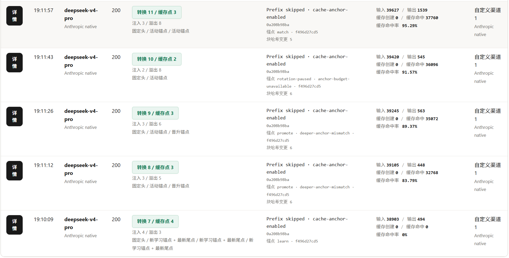
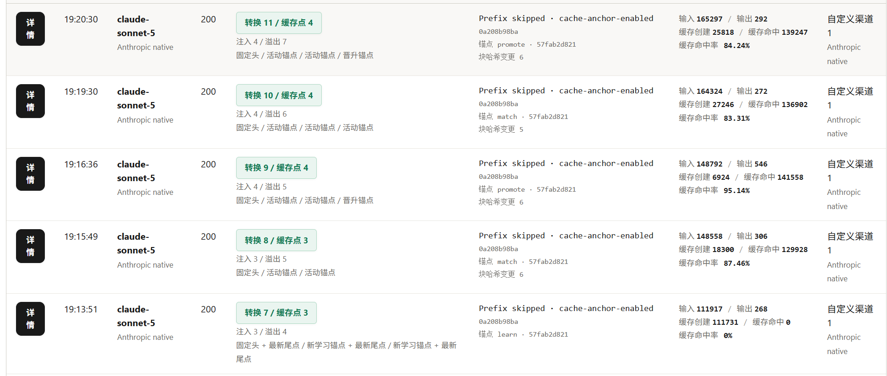
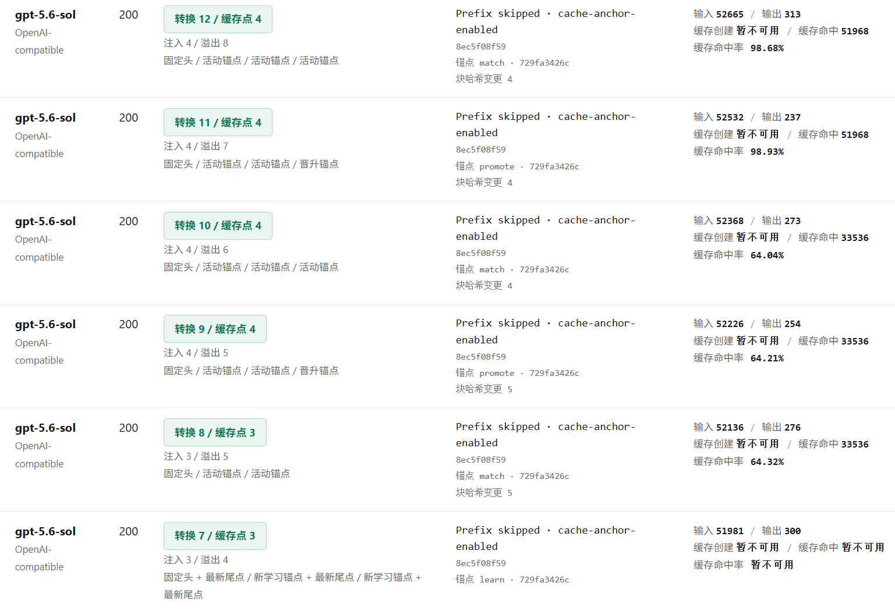

# ST-ClaudeCacheGateway-Continued 使用指南

**ST-ClaudeCacheGateway-Continued** 是基于原项目 [ST-ClaudeCacheGateway](https://github.com/shanye5593/ST-ClaudeCacheGateway) 的继续开发版。它是一个主要面向 SillyTavern / 酒馆的本地 Claude 缓存网关（当然也可接入Cherrystudio、Rikkahub等其他应用），接收 OpenAI-compatible 或 Anthropic native 请求，并在发送给上游前处理缓存断点、Claude prompt cache、Prefix 锁定、渠道 Profile 和高级参数。

本项目主要新增断点保留和轮换策略，目标是在长上下文持续增长时减少稳定缓存边界的无谓移动，从而更容易提高缓存命中率；实际命中情况仍取决于模型、供应商以及缓存点之前的内容是否完全稳定。

默认监听：

```text
http://127.0.0.1:8788
```

酒馆 / 客户端需要填写：

```text
Base URL: http://127.0.0.1:8788/v1
API Key: 你的上游供应商 API Key
```

> 不要把 API Key 写进渠道 Profile 或高级配置。Key 应放在客户端请求头，或仅在可信本机环境里通过 `UPSTREAM_API_KEY` 环境变量传入。

## 快速目录

- [功能概览](#功能概览) · [相对原项目优势](#相对原项目优势) · [效果实测](#效果实测)
- [安装与启动](#安装与启动) · [控制台](#控制台) · [客户端接入](#客户端接入)
- [缓存标记](#缓存标记) · [固定头与锚点](#固定头缓存点与渐进轮换锚点) · [Prefix 锁定](#prefix-锁定--强制锁定)
- [缓存 TTL](#缓存-ttl) · [渠道 Profile](#渠道-profile) · [高级配置](#高级配置)
- [请求诊断](#请求诊断) · [环境变量](#环境变量) · [健康检查](#健康检查)
- [常见问题](#常见问题) · [安全注意事项](#安全注意事项)

## 功能概览

- 可接收 OpenAI-compatible `v1/chat/completions` 请求；同时也兼容Anthropic native `v1/messages` 请求，并对两者间的转换进行特殊优化。
- 支持自动生成缓存断点，傻瓜式操作。
- 系统身份消息处理提供“默认”“关闭Anthropic优化”或“统一将系统身份消息放至最顶部”三种方式；默认对 OpenAI-compatible 上游原样传输，并在转为 Anthropic native 时自动完成保序角色转换与同角色消息合并；另有全局“忽略 Anthropic 优化的模型白名单”，可让支持跨轮 SYSTEM 的 Anthropic 模型保留原始角色与消息边界。
- 支持 `[[CACHE_BREAK]]` 与 `[[CACHE_BREAK_SHORT]]` 两种手动标记；在手动 TTL 下可分别指定 1h 长缓存与 5m 短缓存。
- 支持 Claude `cache_control` 注入，最多 4 个缓存断点。
- 支持固定头缓存点，以及单锚点 / 滚动锚点保留策略。
- 支持 Claude 原生 5 分钟 / 1 小时缓存 TTL、不发送 `ttl` 的自动模式，以及由两种 marker 分别指定长短窗口的手动模式。
- 支持 Prefix 锁定，降低前缀漂移导致的缓存不命中。
- 支持高级配置：全局 Usage、Prefix 锁定与缓存锚点外观，可编辑 Usage 预览示例，并按渠道保存包含 / 排除主体参数和请求头。
- 支持完整请求诊断本地持久化；重启后保留最近日志，最大数量可配置，默认 20。
- 每个最终提示词块都会生成 SHA-256 哈希并与上一条同范围请求对比；短哈希显示在消息标题栏，变化或新增块的哈希会加红。
- 支持将执行到 5m 阶段时的最后一个网关缓存点从 1h 转为 5m，以及忽略末尾 x 个锚点的固定数字 / 评估模式。
- 默认只绑定 `127.0.0.1`，适合本机使用。

## 相对原项目优势

- **固定头缓存点**：默认先从完整候选中锁定最前面的 0–4 点，再执行“忽略末尾锚点”；因此唯一候选同时属于固定头和末尾候选时仍会保留。处理顺序改为高风险自定义后，才可能让忽略阶段先阻止固定头。
- **稳定 Seed（初始锚点）**：新上下文先确定本次真正发送的最多四点，再把排除固定头后的第一个 marker 候选作为 Seed；后缀增长时继续复用该稳定边界，而不是把首次最后一个尾点固定下来。
- **冻结队列式滚动锚点**：首次冻结全部已选非固定点；达到配置的逻辑内容块间隔后，只用一个新点替换最老点，其余位置不变。每次成功请求最多替换一个，失败请求不会推进状态。
- **自动生成、选择与清理断点**：支持自动判断、始终开启和完全关闭三种生成模式；需要生成时，会在最终 SYSTEM 末尾和每个 ASSISTANT 消息后预生成 marker。随后统一规范化 inline、独立 marker、content array 和 Anthropic system 候选，自动去重、删除未选 marker 与空消息，并在固定头、单锚点尾点、冻结滚动点及调用方已有控制之间分配最多四点预算。
- **三条实际请求链路**：统一处理并验证 OpenAI 入站 → OpenAI 上游、OpenAI 入站 → Anthropic 上游、Anthropic 入站 → Anthropic 上游的最终请求体。
- **更完整的诊断**：可查看候选路径、入选原因、上下文短哈希、锚点动作或暂停原因、最终上游请求体以及上游返回的缓存 token 用量；每条 message 显示为一张角色卡，内部保留各 content block、原始路径和缓存断点，每个提示词模块还会显示字符数、基于实际 usage 的 token 估计和块哈希变化状态。
- **更美观、实用的请求日志界面**：可通过哈希值快速检查两次对话间的不同。概览界面能直接显示输入输出、缓存命中或创建、缓存命中率、上下文 ID等数据。同时也能在高级设置处自定义部分数据的标记颜色。
- **快速导入、导出配置**：可以在网页中快速导入、导出json配置文件。
- **支持更新的Anthropic模型，同时对老模型有特殊优化**：原项目针对Anthropic 上游的兼容方式非常简单粗暴，即将system身份消息统一上移合并。该项目针对更新的Anthropic模型（如Fable-5.1），由于其原生支持跨轮系统消息（即可以在用户、AI助手中间插入系统身份的消息），因此对它不加以额外处理。而对应老模型（如Opus-4.6），则默认将system身份消息转换为user身份消息，来保证提示词至少在上下文正确位置。

## 效果实测

以下截图是实际多轮请求记录。缓存命中率仍会受到模型、供应商实现、缓存有效期、提示词是否稳定以及对话轮次等因素影响，因此这些数字是实测样本，不是固定保证值。

从这组实测看，DeepSeek 和 Claude 系列模型的适配与优化效果最好：首轮完成缓存创建后，后续请求的缓存命中率可以达到 80% 以上。GPT 系列模型刚开始时通常只能保证系统提示词等稳定前缀命中；经过多轮对话、缓存锚点逐渐稳定后，聊天记录才更可能一并命中缓存。

**DeepSeek V4 Pro：后续多轮命中率约 80% – 95%。**



**Claude Sonnet 5：后续多轮命中率约为 80% – 90%。**



**GPT-5.6 Sol：初期命中率约为 60%，多轮稳定后可达到 95% 以上。**



## 安装与启动

需要 Node.js 18 或更新版本。

### Windows

下载并解压本项目后，进入 `ST-ClaudeCacheGateway-Continued` 文件夹。可以双击：

```text
start-gateway.bat
```

也可以在终端运行：

```powershell
cd ST-ClaudeCacheGateway-Continued
npm start
```

### macOS / Linux

下载并解压本项目后进入 `ST-ClaudeCacheGateway-Continued`。`.bat` 只适用于 Windows，macOS / Linux 不要运行它。

```sh
cd ST-ClaudeCacheGateway-Continued
chmod +x start-gateway.sh
./start-gateway.sh
```

也可以直接运行：

```sh
npm start
```

### Termux / Android

先下载并解压本项目，再进入 `ST-ClaudeCacheGateway-Continued`。

```sh
pkg update
pkg install nodejs-lts
cd ST-ClaudeCacheGateway-Continued
npm start
```

如果 SillyTavern 和网关在同一台 Android / Termux 设备上：

```text
Base URL: http://127.0.0.1:8788/v1
```

## 控制台

启动后打开：

```text
http://127.0.0.1:8788/
```

控制台包含：

- 网关概览：当前渠道、缓存转译、上游格式、TTL、Prefix 状态。
- 渠道配置：切换 / 保存渠道配置。
- 缓存策略：查看缓存标记、切换 TTL、配置固定头与缓存锚点、自由调整六阶段处理顺序并管理 Prefix 锁定；断点保留参数修改后自动应用。
- 请求日志：开启或关闭请求诊断、查看最终请求体和缓存结果；完整日志保存在本地，重启后继续保留，默认最多 20 条。
- 高级配置：调整 Usage 与 Prefix/锚点外观、编辑预览示例、处理主体参数与请求头，并导入、导出或恢复默认配置。

## 客户端接入

推荐在 SillyTavern / 酒馆里使用 OpenAI-compatible / Chat Completion 接入方式。

```text
Base URL: http://127.0.0.1:8788/v1
API Key: 你的上游供应商 API Key
Model: 你的上游模型名
```

也可以在其他应用里使用 Claude / Anthropic-compatible 原生入站：

```text
POST http://127.0.0.1:8788/v1/messages
POST http://127.0.0.1:8788/v1/messages/count_tokens
```

酒馆里选择的是“入站格式”，决定客户端用哪种协议发给本地网关；控制台里的“上游格式”决定网关再用哪种协议转发给供应商。两者可以不同，例如：

```text
酒馆 OpenAI-compatible 请求 -> 本地网关 -> OpenAI-compatible 或 Anthropic native 上游
```

如果使用 Claude 原生入站，请把当前渠道的上游格式保持为 Anthropic native，暂时不支持Anthropic native 上游 -> OpenAI-compatible 请求

## 系统身份消息处理（专为 Anthropic native 上游优化）

控制台“缓存策略 → 缓存标记与 TTL”提供“系统身份消息处理”选项。它按所选模式处理 **OpenAI-compatible 入站**中的 `system` 消息；Anthropic native 入站本身已经使用顶层 `system`，不参与这一步角色转换。

- **默认**：转发到 OpenAI-compatible 上游时，`system`、`user`、`assistant` 的角色和位置均保持原样；转为 Anthropic native 时，保留请求开头连续出现的 `system` 作为 Anthropic 顶层 `system`，一旦遇到 `user` 或 `assistant`，后续 `system` 会在原位置转换为 `user`，最后按原顺序合并相邻的同角色发言。优点是 OpenAI-compatible 链路完全保真，同时尽量保留 Anthropic 链路的上下文位置；缺点是中途系统内容会失去系统身份，连续同角色消息的原始边界也会被合并。
- **关闭Anthropic优化**：转发到 OpenAI-compatible 上游时仍原样传输；转为 Anthropic native 时，将全部 `system` 集中到 Anthropic 顶层 `system`，不合并相邻的同角色发言。优点是中途系统内容仍以系统身份发送，也不会合并原有的 `user` / `assistant` 消息边界；缺点是会把中途插入的系统消息提前，可能破坏上下文语义，但通常更容易形成稳定的缓存前缀。
- **统一将系统身份消息放至最顶部**：转发到 OpenAI-compatible 上游时，稳定地把全部 `system` 移到 `messages` 最前面；转为 Anthropic native 时，也将全部 `system` 集中到顶层 `system`，且不合并相邻的同角色发言。该模式是用户明确选择的上移策略，不会被白名单覆盖；它可能因中途系统消息被提前而改变上下文语义。

### 忽略 Anthropic 优化的模型白名单

“系统身份消息处理”标题旁的 **忽略 Anthropic 优化的模型白名单** 按钮打开全局编辑面板。默认白名单只有精确模型名 `claude-fable-5-1`，不会自动匹配其它版本后缀；用户可以按行添加未来模型，例如 `claude-opus-*`，也可以保存空列表。

白名单项目按完整 Glob 模式匹配且不区分大小写：`*` 匹配任意长度的字符，`?` 匹配单个字符，其它字符均按字面量处理，不接受正则表达式。输入会去除首尾空格、忽略空项，并按大小写不敏感规则去重；例如 `claude-opus-*` 可匹配 `claude-opus-4` 和 `CLAUDE-OPUS-2026`，但不会匹配前后带额外字符的模型名。

模式矩阵如下：

| 上游 / 入站 | 默认或关闭Anthropic优化 | 统一放至最顶部 |
| --- | --- | --- |
| Anthropic 上游 + OpenAI-compatible 入站 + 命中白名单 | 每个输入 `system` 保留为 `messages` 中独立的 `role: "system"`，保持原始角色、边界和顺序；不把中途 SYSTEM 转为 USER，不集中到顶部，也不合并相邻 USER / ASSISTANT。 | 仍按用户选择将 SYSTEM 统一移动到 Anthropic 顶层 `system`。 |
| Anthropic 上游 + OpenAI-compatible 入站 + 未命中白名单 | 沿用当前 Anthropic 转译优化。 | 沿用当前统一上移逻辑。 |
| OpenAI-compatible 上游 | 沿用现有 `default` / `off` / `top` 语义；白名单不改变 OpenAI wire body。 | 同左。 |
| Anthropic native 入站 | 原样转发该链路的角色结构；白名单不参与。 | 同左。 |

白名单只跳过角色与消息边界优化，不关闭缓存 marker、`cache_control`、缓存锚点或 Prefix Lock。命中判定使用渠道参数合并、排除规则生效后的最终模型名；请求诊断会记录有效处理分支、是否命中以及命中的模式。切换白名单会清空不兼容的缓存锚点和 Prefix Lock 学习状态。

白名单是全局配置，设置会写入 `gateway-settings.json`，并包含在控制台配置导入、导出和恢复默认流程中。配置 schema 当前为 `12`；旧配置缺少该字段时回退到默认项，明确保存的空数组会保持为空。

切换处理方式会清空已学习的缓存锚点和 Prefix Lock 内容，下一次成功请求会按新的提示词结构重新学习。
## 缓存标记

把缓存 marker 放在大段稳定内容之后。可使用以下任一种：

- `[[CACHE_BREAK]]`：在“手动” TTL 下表示 1 小时长缓存。
- `[[CACHE_BREAK_SHORT]]`：在“手动” TTL 下表示 5 分钟短缓存。

在“自动”“5 分钟”或“1 小时”模式下，两种 marker 都跟随全局 TTL，不作长短区分。

网关会在发送上游前移除 marker，并在对应位置注入 Claude prompt cache。例如全局 TTL 为“1 小时”时，任一种 marker 都会生成：

```json
{
  "cache_control": {
    "type": "ephemeral",
    "ttl": "1h"
  }
}
```

适合放在缓存标记之前：

- 系统提示词
- 角色卡
- 蓝灯世界书 / 蓝灯 World Info
- 长篇固定设定
- 固定规则和格式要求

适合放在缓存标记之后：

- 绿灯世界书 / 绿灯 World Info
- 最近聊天记录
- 当前用户输入
- 短期记忆
- 会频繁变化的上下文

简单理解：蓝灯世界书放在 marker 前面，绿灯世界书放在 marker 后面。

### 自动生成缓存断点

控制台“缓存策略 → 缓存标记与 TTL”提供三种生成模式：

- **自动**：先检查格式转换和渠道参数合并后的最终请求，但检查发生在自动生成之前。只要其中包含 `[[CACHE_BREAK]]`、`[[CACHE_BREAK_SHORT]]` 或已有的合法 `cache_control`，就视为调用方已经安排断点，本次不再自动生成；三者都没有时才生成。使用“忽略最末 x 个锚点”时推荐选择此模式，让网关只在调用方没有安排断点时补齐候选，再裁掉容易变化的末尾候选。
- **开启**：始终执行自动生成。已有 marker 会去重，但不会因为请求中存在手写断点而跳过其他生成位置。
- **关闭**：不自动生成，只处理调用方提供的 marker 或 `cache_control`。这是新安装和旧版关闭状态的默认值。

> “忽略最末 x 个锚点”推荐搭配“自动”生成模式使用。这样既能自动为普通对话生成候选断点，又能在四点预算选择前排除末尾不稳定候选；调用方明确提供的 `cache_control` 仍保持权威，不会被该选项删除。具体数字和评估模式见[“忽略最末 x 个锚点”](#忽略最末-x-个锚点)。

需要自动生成时，网关会在渠道请求体参数合并完成后进行预处理：

- 在 OpenAI-compatible 最后一个 `system` 消息的末尾生成一个普通 `[[CACHE_BREAK]]`。
- 在 Anthropic native 顶层 `system` 的末尾生成一个普通 `[[CACHE_BREAK]]`。
- 在每个 `assistant` 消息的末尾生成一个普通 `[[CACHE_BREAK]]`。
- 已经位于末尾的 marker 不会重复生成；空内容或没有可落点内容块的消息会跳过并写入诊断。

自动生成的普通 marker 在“手动” TTL 下使用 1h。自动生成只负责提供候选边界，之后仍执行去重、固定头、锚点、冻结/尾点选择和四点预算策略；所有 marker 在发送上游前都会被移除。关闭“缓存转译”时不会生成 marker，也不会转译手写 marker。

切换自动生成模式会清空已学习的锚点和 Prefix Lock 内容，下一次成功请求会按新的候选边界重新学习。

Claude 每个请求最多支持 4 个缓存断点。两种 marker、自动生成的候选和调用方已有的 `cache_control` 共用这 4 个位置；所有未选中的 marker 仍会被移除，不会原样发给上游。

## 固定头缓存点与渐进轮换锚点

当提示词不断增长、候选断点超过 4 个时，单纯保留最前或最后 4 点都可能让一个原本稳定的缓存边界在相邻请求间移动。“缓存策略 → 断点保留策略”提供两类控制：

- **固定头缓存点**：填写 `0`–`4`。例如设为 `1`，最前面的第一个候选断点始终保留，后面的可用位置再分配给锚点和最新尾点。
- **单锚点**：新上下文会先按四点预算选出固定头和最新尾点，再把“最终已选断点中排除固定头后的第一个 marker 候选”学为锚点。只要锚点之前的完整前缀不变，后续请求都会继续保留它；前缀变化、重启或手动“清空锚点并重学”会触发重新学习。
- **滚动锚点**：首次成功请求会冻结当时实际入选的全部非固定点。后续内容增长时不再重选普通尾点；只有最新冻结点之后又出现达到设定间隔的新候选时，才用一个新点替换最老的非固定点，其余点保持原位。

例如固定头为 1、滚动间隔为 3，首次实际入选 `A / E / F / G` 后，缓存点会这样变化。下面只列缓存断点所在的字母，未列出的字母仍然保留在请求正文中：

```text
首次成功：A / E / F / G
新增 H、I：A / E / F / G       （全部位置不变）
新增 J：   A / F / G / J       （只把最老的 E 替换为 J）
新增 K、L：A / F / G / J       （全部位置不变）
新增 M：   A / G / J / M       （只把最老的 F 替换为 M）
```

`A` 始终是固定头。首次成功后，`E / F / G` 都进入冻结滚动队列；`H / I` 到来时不会把 `G` 移到最新消息。到 `J` 时，与最新冻结点 `G` 已相隔 3 个逻辑内容块，于是只执行 `E → J`；下一轮同理只执行 `F → M`。首次固定下来的最后一个点会保留为保护尾锚点，直到它成为待淘汰锚点；学习、替换和淘汰都只在上游请求成功后提交。

“末锚点自动使用 5 分钟”默认作为最后阶段运行，会找到当时已选中的最后一个网关自有缓存点并将 1h 改为 `ttl: "5m"`；固定头、普通尾点和策略锚点都可以成为目标。调用方控制点不会被覆盖；目标之后若存在调用方 1h 控制，会以 `caller-later-1h` 原因跳过。若用户把该阶段提前，它只处理执行到当时已有的末点，可能无目标或被后续新增点取代。

### 忽略最末 x 个锚点

这个选项用于在四点预算选择之前，先排除最靠近对话末尾、容易随请求变化的候选锚点。推荐搭配“自动生成缓存断点”的“自动”模式使用。

- **数字模式**：填写非负整数 `x`。默认顺序会先锁定固定头，再考察最新 x 个候选；已经被更高阶段锁定的点不会被忽略，其余末尾候选被阻止。`x=0` 表示不裁剪，调用方原有的 `cache_control` 始终不会被删除。
- **评估模式**：启动或重新评估时，实际生效的 `x` 会先设为 `0`。请在同一渠道、同一协议和同一模型下连续完成 3 次成功对话；失败请求不计数，范围变化会清零并重新开始。
- **评估方法**：第三次成功后，网关比较三份有序块哈希，找到最早发生变化、新增或缺失的块，并把该块自身及其后的候选锚点数作为结果 `x`。缺少可比较哈希或无法映射变化边界时不会自动填入，可以重新评估。
- **结果处理**：`x=0–5` 会自动切回数字模式、填入并持久化；`x≥6` 会保留真实结果并提醒检查预设，只有明确点击“仍填入 x=N”后才会保存。选择“重新评估”会再次从 `x=0` 开始。

默认处理顺序为：

1. `固定头缓存点`
2. `忽略末尾锚点`
3. `缓存锚点`
4. `普通尾点填充`
5. `保护尾锚点`
6. `末锚点自动使用 5 分钟`

控制台允许完全自由排序。选点阶段越靠前，越早锁定候选和四点预算，后续阶段不能删除或挤掉它；5m 阶段则只处理运行到该位置时已经选出的末点。编号是阶段固定编号，拖动后不会随位置改变；5m 开关关闭时对应阶段显示为灰色“（未启用）”。顺序、固定头、滚动间隔、忽略数量等参数修改后会自动保存，无需再点击应用。更改顺序会清空已有锚点和 Prefix 学习数据。

固定头、锚点、普通尾点和调用方已有的 `cache_control` 总计不能超过 4 点。例如固定头为 1，A 是固定头、F 是单锚点，在长上下文里剩余两个位置应给最新尾点 O、P，最终是：

```text
A / F / O / P
```

首次学习时也是同一规则。例如固定头为 1、当前最终入选四点为 `A / E / F / G`：单锚点模式只学习 E，F/G 仍是普通尾点；滚动模式则一次冻结 E/F/G，并从最新冻结点 G 开始计算下一次轮换间隔。

不会再加入第五个 N 点。如果固定头设为 `4`，锚点会显示“无可用配额”；减少固定头数量后才能学习或轮换。若已有 `cache_control` 使固定头保证无法满足，请求会返回明确的预算冲突错误；若调用方控制点占用了滚动替换所需的预算，网关会保留内存中的冻结队列并暂停本次轮换。

滚动模式以成功请求为提交边界：上游非 2xx、网络错误、请求取消和 `/count_tokens` 都不会学习、晋升或淘汰锚点。不同渠道、上游协议、模型和 TTL 的学习上下文彼此隔离，内存中最多保留 32 个最近使用的上下文。

策略设置会持久化到 `gateway-settings.json`。旧配置运行时迁移到 `schemaVersion: 12`，缺失的处理顺序、日志上限、预览示例、Prefix/锚点外观、Prefix 启用状态和 Anthropic 优化模型白名单会自动补齐；渠道 Profile 不会从默认文件覆盖用户渠道。

运行学习数据与诊断日志使用两个独立的本地文件：

- `gateway-runtime-state.json`：锚点上下文、滚动进度、保护尾锚点、忽略评估样本、Prefix 锁定内容及块哈希快照。
- `gateway-request-logs.json`：完整请求诊断，默认最多保存 20 条，可在请求日志页面设置 1–1000。

两者均已加入 `.gitignore`。损坏或版本不兼容时网关会记录状态并以空数据继续启动；学习状态仍只在成功上游请求后提交。清空日志会同步清除磁盘日志和块哈希比较快照。

> 缓存锚点与 Prefix Lock 互斥，采用“最后启用者生效”：启用单锚点或滚动锚点会关闭并清空 Prefix Lock；启用 Prefix Lock 会把锚点模式切回“关闭”并清空已学习锚点。固定头策略本身可以继续保留。

## Prefix 锁定 / 强制锁定

Prefix 锁定是给“缓存点前面的内容不够稳定”准备的保护功能。它不是必须开启的功能；如果你的缓存点前内容本来就稳定，可以先不开。

它解决的问题是“前缀漂移”：有些酒馆配置、插件、世界书、正则、数据库填表内容或动态注入内容（例如双人成行预设），可能会在缓存 marker 之前插入变化内容。只要缓存点之前有细微变化，Claude 看到的稳定前缀就不再完全一致，就会重建缓存。

开启后：

1. 第一个带缓存点的最终请求会教会网关“稳定前缀”。
2. 网关会记录从请求开头到第一个 `cache_control` 为止的内容。
3. 后续请求会丢弃当前请求里的缓存点前缀，强制替换为已经学习到的稳定前缀。
4. 缓存点之后的内容仍使用当前请求的新内容，例如近期聊天、当前输入、绿灯世界书等。

这是一种替换，不是追加，所以不会把世界书、系统提示词或角色卡重复拼接。

适合开启 Prefix 锁定的情况：

- 你已经正确放置了缓存 marker，但缓存仍然不稳定。
- 怀疑世界书、正则、插件、数据库填表在缓存点前产生了动态变化。
- 想临时验证缓存不命中是否由前缀漂移造成。

不建议长期无脑开启的情况：

- 你经常切换角色卡、世界书或预设。
- 你希望缓存点之前的内容每轮都能自然更新。
- 你还没有确认哪些内容应该放在缓存点前、哪些应该放在缓存点后。

更换以下内容后，请清空并重新学习 Prefix：

- 角色卡
- 世界书
- 预设
- 主要系统提示词
- 任何应该位于缓存标记之前的内容

如果关闭首页“缓存转译”，Prefix 锁定也会跳过，不会参与请求处理。

Prefix Lock 与缓存锚点不能同时启用。启用 Prefix Lock 会关闭锚点模式并清空锚点；之后若启用单锚点或滚动锚点，网关会反过来关闭并清空 Prefix Lock。

## 缓存转译总开关

首页的“缓存转译”是总开关。

开启时：

- 网关识别 `[[CACHE_BREAK]]` 和 `[[CACHE_BREAK_SHORT]]`。
- 网关注入 `cache_control`。
- Prefix 锁定可以参与请求处理。

关闭时：

- 网关不处理两种缓存 marker。
- 网关不注入 `cache_control`。
- Prefix 锁定会跳过。
- 高级配置仍然生效。
- 渠道 Profile 和上游格式转换仍然生效。

如果你只是想临时绕过缓存处理，但仍想保留渠道、高级参数、请求头规则，可以关闭“缓存转译”。

## 缓存 TTL

缓存策略页可以切换 TTL：

- `自动`：不发送 `ttl`，交给上游供应商默认 ephemeral 缓存窗口处理。
- `5 分钟`：两种 marker 都发送 Claude 原生短缓存窗口：`ttl: "5m"`。
- `1 小时`：两种 marker 都发送 Claude 原生长缓存窗口：`ttl: "1h"`。
- `手动`：`[[CACHE_BREAK]]` 发送 `ttl: "1h"`，`[[CACHE_BREAK_SHORT]]` 发送 `ttl: "5m"`。

换句话说，只有“手动”会让两种 marker 表示不同 TTL；在另外三种模式中，两种 marker 都服从同一项全局设置。自动生成断点使用普通 `[[CACHE_BREAK]]`，所以它在手动模式下属于 1h 断点。

所有来源的断点共用上游最多 4 点预算，包括两种 marker、自动生成点和调用方已有的 `cache_control`。若同一请求混用 1 小时与 5 分钟缓存点，所有 `1h` 点必须位于所有 `5m` 点之前；网关会在最终发送前检查顺序，并对“5m 后又出现 1h”的请求返回明确的 400 错误。

如果上游或模型不支持 1 小时 TTL，请使用“5 分钟”或“自动”。“手动”模式中只要入选了 `[[CACHE_BREAK]]`，就仍会发送 1h。

也可以用环境变量启动：

```sh
CACHE_TTL=auto npm start
```

如需从环境变量启用手动 TTL：

```sh
CACHE_TTL=manual npm start
```

## 渠道 Profile

渠道 Profile 会持久化到本地 `gateway-settings.json`，保存：

- 渠道名称
- Base URL
- 上游格式
- 高级主体参数
- 高级请求头规则

不会保存 API Key。

默认渠道：

- Pioneer：默认自定义渠道，默认连接 `https://api.pioneer.ai`，上游格式默认 OpenAI-compatible。
- OpenRouter：内置模板，默认 `https://openrouter.ai/api/v1`，上游格式通常用 OpenAI-compatible。
- Anthropic：内置模板。
- Google Vertex AI：内置模板。
- Amazon Bedrock：内置模板。
- 自定义渠道：可以新建、重命名、保存、删除。

注意：Vertex 和 Bedrock 卡片目前是 Profile 模板，不包含 Google Auth 或 AWS SigV4 签名。如果你需要真实云厂商鉴权，建议先通过兼容供应商、自定义代理或后续专门实现的鉴权层接入。

## OpenRouter 供应商锁定

OpenRouter 渠道支持“锁定供应商”。它会把 provider 参数写入请求体，例如锁定 Amazon Bedrock：

```json
{
  "provider": {
    "order": ["Amazon Bedrock"],
    "allow_fallbacks": false
  }
}
```

控制台里可以：

- 选择常见供应商。
- 选择“自定义”后输入任意 OpenRouter 支持的供应商名。
- 关闭锁定，恢复不指定 provider。

如果 OpenRouter 没有在响应体或响应头返回实际供应商，诊断页可能显示 unknown；这不代表锁定没发送。以最终请求体里的 provider 字段为准。

## 高级配置

Usage 外观是全局显示设置；主体参数和请求头处理仍按当前渠道 Profile 保存。

### Usage 外观

控制台可分别设置输入、输出、缓存命中、缓存创建，以及四档缓存命中率的文字色和背景色。直接点击预览中的任一数据会在原位置切换到示例编辑表单；输入、缓存命中和命中率按 `缓存命中率 = 缓存命中 / 输入` 自动联动，输出与缓存创建独立编辑。点击“应用外观与示例”后写入 `gateway-settings.json`，重启和切换渠道后仍保留。

### Prefix 锁定 / 缓存锚点外观

可分别设置 Prefix 锁定、缓存锚点、“缓存点额度不足”和“块哈希变更数字”的文字色、背景色与透明状态，并即时预览。配色作用于请求日志组合列和请求详情；其他失败标签继续使用系统语义色。Prefix 与锚点都关闭时，请求日志不会显示对应的“关闭”行。

### 配置导入、导出与恢复默认

“当前 cache_control / 状态 JSON”面板提供：

- **导出配置**：下载当前可导入的全局及高级配置。
- **导入配置**：导入 JSON，其中包含 Anthropic 优化模型白名单等全局设置，但始终保留当前 `upstreamMode`、`upstreamBaseUrl`、活动渠道及渠道 Profile，并忽略 `anchorState`、`cacheAnchorState` 等学习状态。
- **恢复默认配置**：实时读取项目根目录的 `default-gateway-settings.json`；同样不会替换当前上游连接，应用后清空不兼容学习数据。

### 包含主体参数

填写 JSON 对象，网关会把它深度合并进最终请求体。

示例：

```json
{
  "output_config": {
    "effort": "max"
  },
  "reasoning": {
    "effort": "max"
  },
  "reasoning_effort": "max"
}
```

这个功能同时作用于 OpenAI-compatible 和 Anthropic native 上游格式；请求体会先完成渠道参数合并，再执行缓存断点选择。请只填写目标上游协议支持的字段。

### 排除主体参数

一行一个字段路径，发送上游前删除对应字段。

示例：

```text
stream_options
metadata.trace_id
provider.allow_fallbacks
```

适合用于删除某些供应商不接受的请求体字段。

### 包含请求头

填写 JSON 对象，网关会添加或覆写非密钥请求头。

示例：

```json
{
  "HTTP-Referer": "https://example.com",
  "X-Title": "ST-ClaudeCacheGateway-Continued"
}
```

不允许保存密钥或协议敏感 header，例如：

- `authorization`
- `x-api-key`
- `cookie`
- `set-cookie`
- `host`
- `content-length`
- 包含 `token` / `secret` / `password` 的 header

### 排除请求头

一行一个 header 名，发送上游前删除。

示例：

```text
x-real-ip
x-forwarded-for
```

这可以用于删除某些代理、客户端或平台自动附带但你不想发给上游的 header。

## 请求诊断

请求诊断初始默认关闭。开关保存到 `gateway-settings.json`；完整记录和正文保存到 `gateway-request-logs.json`，因此重启后仍可查看旧日志。最大保留数量默认 20，可在请求日志页设为 1–1000；降低上限会立即删除最旧记录。

开启后，网关会保存最近请求记录，用于查看：

- 最终请求体中的每个提示词块 SHA-256 哈希，以及与上一条同渠道 / 协议 / 模型请求的变化标记；标题栏显示 10 位短哈希，完整当前值和上次值保留在诊断 JSON。
- Usage 以双列方式对齐显示“输入 / 输出”和“缓存命中 / 创建”，命中率单独成行并按区间着色；Anthropic 会把未缓存、读取和创建输入按协议口径合并计算。

- 最终发给上游的请求体
- 请求头摘要
- 缓存断点位置
- 最终入选的每个断点及其选择原因（固定头、冻结活动锚点、单槽替换新锚点、最新尾点或调用方已有控制）；候选中未发送的点会在原始位置显示为紧凑的灰色“未使用缓存点”框
- Prefix hash / suffix hash
- 上游状态码
- 上游返回的缓存 read / creation token 用量
- 每个可视化提示词模块的字符数和 token 估计。OpenAI-compatible 上游直接使用完整的 `inputTokens`；Anthropic native 上游使用 `inputTokens + anthropicCacheReadInputTokens + anthropicCacheCreationInputTokens`，再除以全部模块字符数得到倍率。没有有效 usage 时只显示字符数并明确标为暂不可估

诊断记录可能包含私密提示词、聊天内容、世界书内容和最终上游请求体。不要公开分享导出的诊断 JSON。需要特别注意：旧记录和诊断开关都会跨重启保留；排查完成后请主动关闭诊断并清空记录，本地日志文件会同步清空。

## 环境变量

| 变量 | 默认值 | 说明 |
| --- | --- | --- |
| `HOST` | `127.0.0.1` | 监听地址。默认仅本机访问。 |
| `PORT` | `8788` | 监听端口。 |
| `UPSTREAM_BASE_URL` | `https://api.pioneer.ai` | 启动时的上游地址默认 / 覆盖。 |
| `UPSTREAM_MODE` | `openai` | 上游格式：`anthropic` 或 `openai`。 |
| `UPSTREAM_EXTRA_JSON` | `{}` | 启动时包含主体参数。 |
| `UPSTREAM_EXCLUDE_PATHS` | 空 | 启动时排除主体参数，逗号或换行分隔。 |
| `UPSTREAM_HEADERS` | `{}` | 启动时包含请求头。不要写密钥。 |
| `UPSTREAM_EXCLUDE_HEADERS` | 空 | 启动时排除请求头，逗号或换行分隔。 |
| `UPSTREAM_API_KEY` | 空 | 当客户端没有传 API Key 时的 fallback。仅建议私有环境使用。 |
| `CACHE_TTL` | `1h` | `auto`、`5m`、`1h` 或 `manual`；旧值 `default` 仍兼容并等同于 `auto`。 |
| `CACHE_TRANSLATION_ENABLED` | `true` | 是否启用缓存转译。 |

示例：

```sh
UPSTREAM_BASE_URL=https://api.pioneer.ai PORT=8788 npm start
```

OpenAI-compatible 上游：

```sh
UPSTREAM_MODE=openai npm start
```

关闭缓存转译：

```sh
CACHE_TRANSLATION_ENABLED=false npm start
```

PowerShell 示例：

```powershell
$env:UPSTREAM_BASE_URL = 'https://api.pioneer.ai'
$env:PORT = '8788'
$env:CACHE_TTL = 'auto'
npm start
```

## 健康检查

```sh
curl http://127.0.0.1:8788/health
```

示例响应：

```json
{
  "ok": true,
  "host": "127.0.0.1",
  "port": 8788,
  "upstreamBaseUrl": "https://api.pioneer.ai",
  "upstreamMode": "openai",
  "cacheTtl": "1h"
}
```

## 常见问题

### macOS 打不开 `start-gateway.bat`

`.bat` 是 Windows 批处理文件。macOS / Linux 请用：

```sh
chmod +x start-gateway.sh
./start-gateway.sh
```

或直接运行：

```sh
npm start
```

### 酒馆请求 404 或路径不对

优先把 Base URL 填完整：

```text
http://127.0.0.1:8788/v1
```

### 请求日志要一直开吗？

不建议。请求诊断会把完整提示词写入本地日志，且开关与最近记录都会跨重启保留。诊断结束后请关闭并清空日志。

### 缓存不命中

检查：

- 所用预设是否用了大量的{{random}}，例如双人成行预设，会使每次发送的系统提示词都不同
- 稳定内容是否都在缓存 marker 之前。
- 蓝灯世界书是否在 marker 之前，绿灯世界书是否在 marker 之后。
- 最近聊天和当前输入是否在 marker 之后。
- 是否有世界书、正则、插件在缓存点之前插入动态内容。
- 必要时开启 Prefix 锁定测试是否是前缀漂移。
- 候选断点持续增长时，可配置固定头或滚动锚点，并在请求详情里检查每个断点的选择原因。

### 使用数据库会影响缓存吗？

使用数据库本身不影响缓存。官方渠道验证正常；如果出现数据库相关异常，通常是第三方实现或接入方式的问题。

需要注意的是：如果数据库的蓝灯条目会随着填表内容更新，它就不再是稳定前缀。此时应把全局注入位置改到缓存点后面，例如“角色后”或“系统”这类位于缓存点后的注入位置，避免它在缓存点前变化导致缓存失效。

### 上游报不支持 `ttl: 1h`

到“缓存策略”把 TTL 切换为“5 分钟”或“自动”。如果当前为“手动”，请注意普通 `[[CACHE_BREAK]]` 会明确要求 1h；仅使用 `[[CACHE_BREAK_SHORT]]`，或直接切换全局 TTL。

选择“自动”也可以在启动时使用：

```sh
CACHE_TTL=auto npm start
```

### 可以把 Key 保存到 Profile 吗？

不建议，也不允许。网关会拒绝明显密钥字段。请让客户端发送 API Key，或仅在私有本机环境下使用 `UPSTREAM_API_KEY`。

## 安全注意事项

- 不要公开诊断 JSON、请求日志、聊天导出、世界书内容。
- 不要把 API Key 写进 README、Profile、高级配置或截图。
- 默认绑定 `127.0.0.1`，建议保持仅本机访问。
- 请求诊断初始默认关闭，但开关和完整日志都会跨重启保留；排查完成后请手动关闭并清空本地记录。
